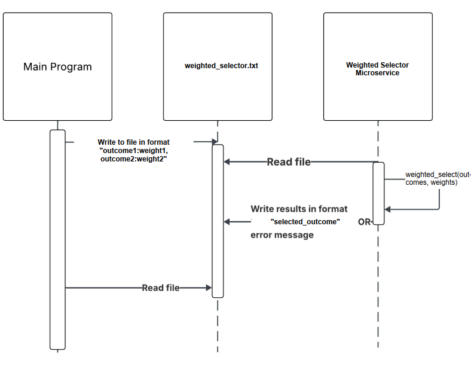

# WeightedSelector
Microservice for selecting one item from a list based on custom probability 
weights. Can handle 2-100 outcomes with any positive weight values. Returns 
a single selected outcome as a string. Uses text files as a communication pipe.

## How to request selections from WeightedSelector
Write to text file named "weighted_selector.txt" a string in the format 
"outcome1:weight1,outcome2:weight2,outcome3:weight3" where outcomes are 
strings and weights are positive numbers (integers or decimals). Weights are 
relative - they don't need to sum to 100. For example, to select loot rarity 
with 60% common, 30% rare, 10% legendary: Common:60,Rare:30,Legendary:10. 
Number of outcomes is limited to 2-100 per request.

Example write:

    with open("weighted_selector.txt","w") as file:
        file.write("Common:60,Rare:30,Legendary:10")

## How to receive selections from WeightedSelector
Give a number of seconds for WeightedSelector to process and write results 
back into "weighted_selector.txt" (perhaps with a sleep), then read from text 
file "weighted_selector.txt". Results will be a single selected outcome 
string (e.g., Rare). Alternatively if an error occurred an error message in 
the format "ERROR:[error message]" will be written to the 
"weighted_selector.txt" file.

Example read:
    
    time.sleep(0.5)
    with open("weighted_selector.txt","r") as file:
        result = file.read()

## UML Sequence Diagram

